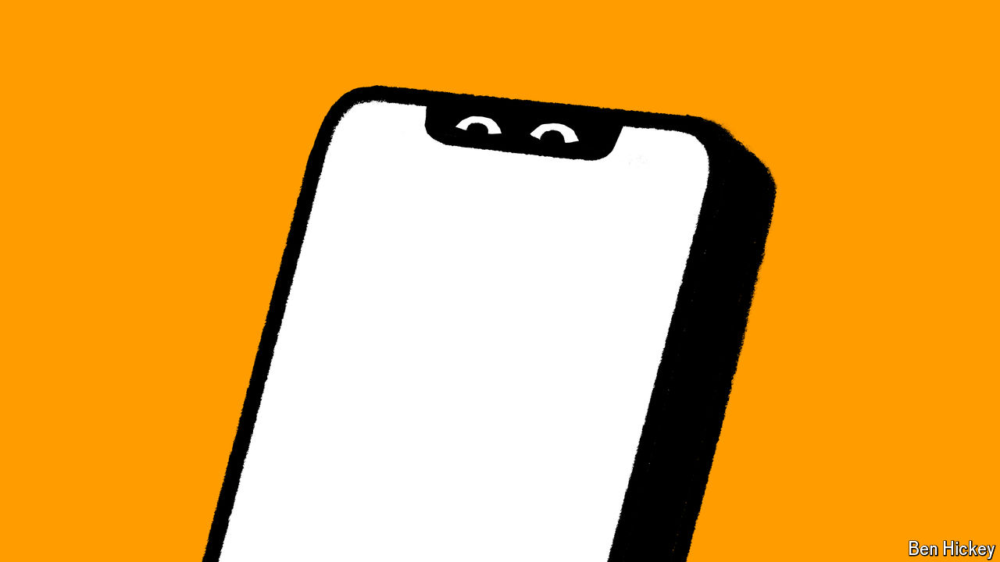

###### Cyber security

# It is dangerously easy to hack the world’s phones 

##### A system at the heart of global telecommunications is woefully insecure 

 

> May 17th 2024 

FOR YEARS experts have warned that a technology at the centre of global communications is dangerously exposed. Now there is more evidence that it has been used to snoop on people in America. 

Kevin Briggs, an official at America’s Cybersecurity and Infrastructure Security Agency, told the Federal Communications Commission (FCC), a regulator, earlier this year that there had been “numerous incidents of successful, unauthorised attempts” not only to steal location data and monitor voice and text messages in America, but also to deliver spyware (software that can take over a phone) and influence voters from abroad via text messages. The comments were first reported by , a technology news website. America’s big mobile operators have erected better defences in recent years. But much of the world remains vulnerable.

