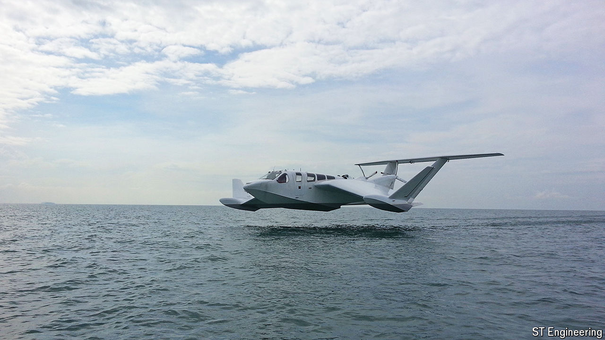

###### Marine technology

# The AirFish is a fast ferry that will fly above the waves 

##### It takes inspiration from the “Caspian Sea Monster” 

 

> May 22nd 2024 

In the 1960s, during the height of the cold war, American  spotted an unusual stubby-winged craft at a Soviet naval base on the Caspian sea. Was it a boat, was it a plane? Dubbed the “Caspian Sea Monster”, it turned out to be a heavily armed naval craft some 100 metres long designed to attack submarines and aircraft carriers. 

The Ekranoplans, as they were called, relied on an aerodynamic effect called wing-in-ground (WIG) to avoid radar by flying just above the surface of the water. This phenomenon exploits an area of higher pressure created between the lower surface of the wing and the ground, reducing drag and giving the wing more lift. (It also explains why some planes coming in to land appear to their pilots to “float” along when just above the runway.) While various military WIG craft have appeared over the years, they remain a rarity. That may change as a range of smaller versions, called AirFish, are launched as high-speed ferries.

