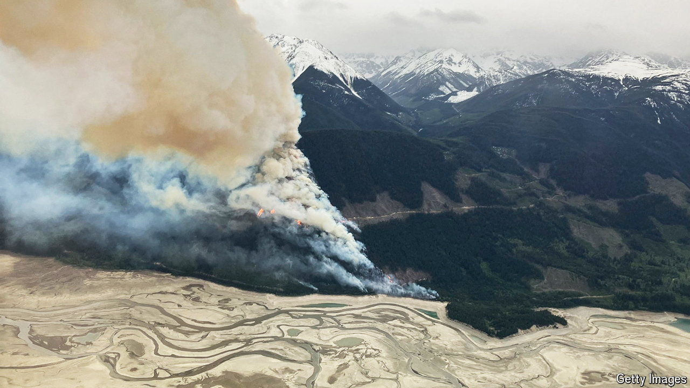

###### Lessons learned after Canada’s Frankenfires

# Canadians are taking dramatic steps to avoid more ruinous firestorms 

##### The focus is as much on mitigation and preparation as on suppression 

 

> May 23rd 2024 

Stumpy, soot-stained foundations of homes, charred fir trees that crumble when touched and the skeletons of petrol stations offer mute testimony to the ferocity of the wildfire that roared through the hamlet of Scotch Creek last year. The smoke from it and myriad other Canadian fires reached Baltimore, Barcelona, Berlin and beyond. 

Wildfires scorched 185,000 square km (71,000 square miles) of Canada in 2023, an area bigger than Florida. The resulting pall forced millions indoors during the height of summer. The fires also pumped 1,800 megatonnes of CO2 equivalent into the atmosphere, dwarfing Canada’s total emissions in 2022 of 708 megatonnes. Locals called the blazes Frankenstein fires “that crawl or sprint along like some diabolical monster”. “The fires defy models,” says John MacLean, chief administrative officer of nearby Columbia Shuswap District. “They are alien to experience.” 

