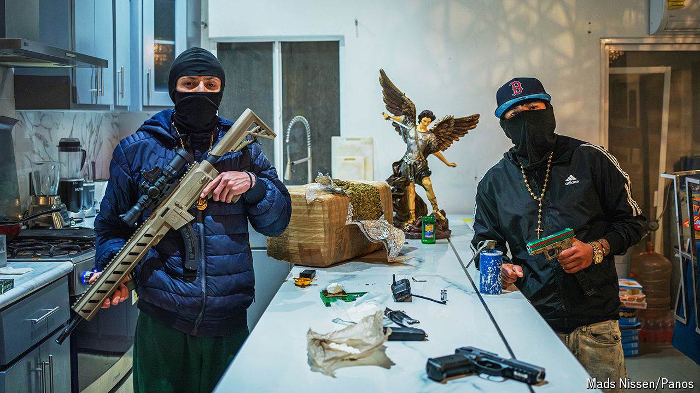

###### The villains are thriving

# Criminal gangs are showing their muscle as Mexico’s elections loom 

##### The next president must make the country safer 

 

> May 22nd 2024 

It has been a bloody month for Mexico’s southern state of Chiapas. On May 19th a candidate running in next month’s local elections was attacked, and five members of his team shot dead. That came days after a mayoral candidate was killed with five others, and an apparent gang shoot-out in which 11 people died. 

For  such news is all too frequent. Murders in their state rose by 60% in the first three months of this year, compared with the same period in 2023. Criminal groups are fighting to control territory for moving drugs and migrants, who enter Mexico from Guatemala through Chiapas. “We used to be a poor-but-safe state,” says Francisco Rojas, a candidate for mayor of Tuxtla Gutiérrez, the state capital. Now Chiapas is dangerous, as well as poor. It typifies the insecurity under President Andrés Manuel López Obrador and the government led by his Morena party as his six-year term comes to a close. 

