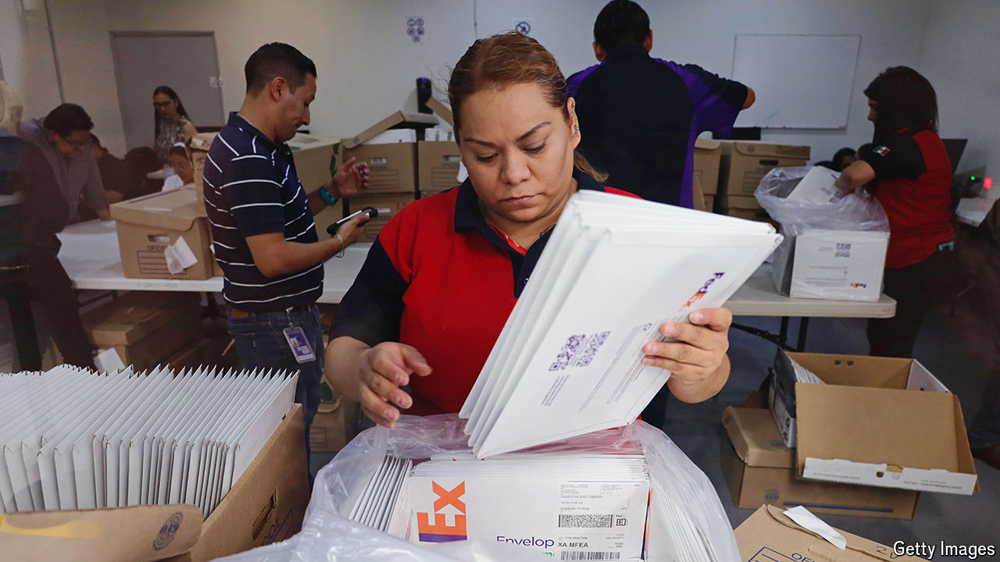

###### The vote bank in the United States

# Mexico’s mighty diaspora punches below its weight in elections 

##### But its participation is steadily increasing 

 

> May 23rd 2024 

DURING MEXICO’S presidential election campaign in 2000, Vicente Fox, the winning candidate, rode a horse through Chicago’s Little Village neighbourhood. He wore a cowboy hat, true to his roots as a rancher in Guanajuato state. He wasn’t asking for votes—back then, Mexico’s diaspora had no voting rights—but he distributed phone cards and told Chicagoans to ring their families in Mexico and tell them to vote for him. Members of the diaspora were enfranchised in 2005. On June 2nd they will vote in record numbers.

Yet Mexico’s mighty diaspora still punches far below its electoral weight. Roughly 97% of the 12m émigrés born in Mexico reside in the United States. Yet only about 1.5m Mexicans abroad have a voter’s ID card. And of those, a paltry 227,000 have registered to vote in this year’s elections. With Claudia Sheinbaum, the ruling Morena party’s candidate, looking well set to succeed her mentor, President Andrés Manuel López Obrador, the diaspora’s vote is unlikely to shift the needle. 

