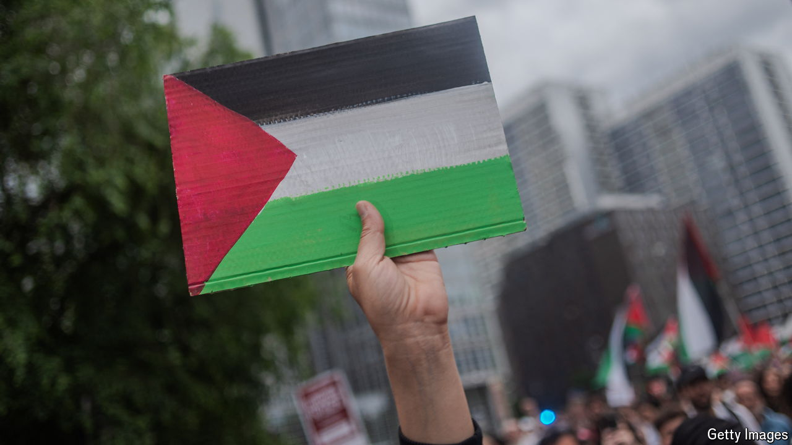

###### The Economist explains

# What does it mean to recognise Palestinian statehood? 

##### Ireland, Norway and Spain will be the latest to do so 

 

> May 22nd 2024 

IT IS A step to “bring peace to the Middle East”, according to Simon Harris, Ireland’s prime minister. On May 22nd his country, along with Norway and Spain, said that it would formally recognise Palestine as a state. Israel recalled its ambassadors from all three countries in response; its foreign minister condemned the trio’s decision as a “distorted step” and said it was evidence, in the wake of Hamas’s attack on  on October 7th, that “terrorism pays”. Ireland, Norway and Spain are joining the majority of countries: almost three-quarters of members of the UN recognise Palestine. What exactly does that mean—and who are the holdouts?

There are no binding rules about when one country should recognise another, but international law provides some guidelines. The Montevideo Convention on the rights and duties of states, signed by 20 countries in North and South America in 1933, sets out four criteria: a state should have a permanent population; a government; defined borders; and the capacity to enter into relations with other states. But many places recognised as states do not meet those requirements—for instance those with two governments, such as Libya. (Recognising a state usually implies recognising its government, but in such cases countries may choose to endorse whichever government that they consider legitimate.) Some states emerge after national movements declare independence and seek international recognition.

