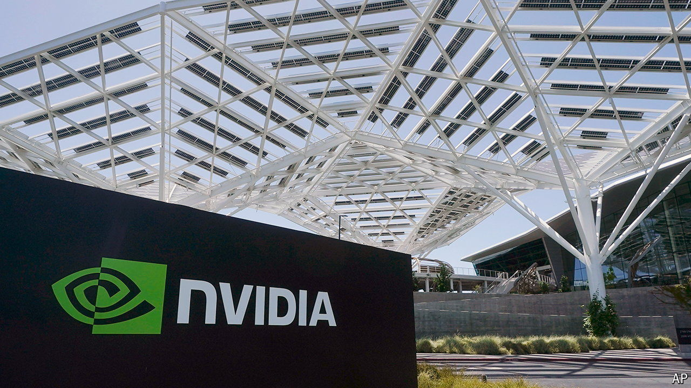

###### The world this week

# Business 

#####  

 

> May 23rd 2024 

The demand for chips to power artificial-intelligence services from the likes of Meta and Microsoft helped boost  revenues to $26bn in the latest quarter, a 262% increase, year on year. Net profit soared by 628% to $14.9bn. The company promises more to come. It will soon start to ship its new Blackwell chips, which cost more than $30,000 each.

Non-performance pay

