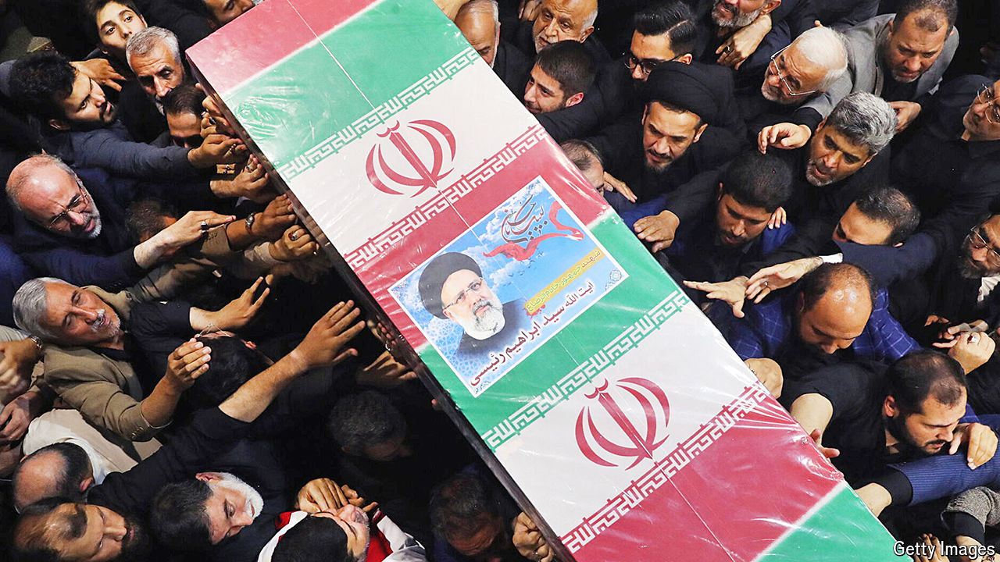

###### The world this week

# Politics 

#####  

 

> May 23rd 2024 

 president, , and its foreign minister, Hossein Amirabdollahian, were killed in a helicopter crash. The country’s supreme leader, Ayatollah Ali Khamenei, named a caretaker president ahead of elections on June 28th. Mr Raisi was a leading contender to succeed Mr Khamenei as supreme leader. His death makes it more likely that Mr Khamenei’s son, Mojtaba, will replace his father.

The  prosecutor announced that he was seeking arrest warrants for the Israeli prime minister, Binyamin Netanyahu, and defence minister, Yoav Gallant, as well as three leaders of Hamas. Joe Biden, the American president, called the Israeli warrants “outrageous”; his government may work with Congress to impose sanctions on the ICC. Mr Netanyahu’s opponents, who have threatened to leave his government if he does not change course in Gaza, rallied round him too. 

