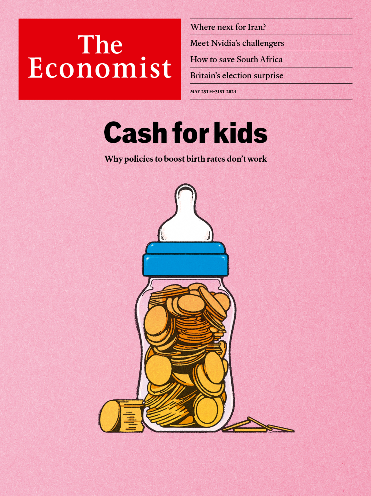

###### The Economist

# This week’s covers 

##### How we saw the world 

> May 23rd 2024 

WE have two covers this week. In most of the world we consider why baby-boosting policies won’t work. As birth rates plunge in rich countries, many politicians are keen to pour money into policies that might lead women to have more children. Yet all these attempts are likely to fail, because they are built on a misapprehension. The bulk of the decline in the fertility rate in such countries is among younger, poorer women who are delaying when they start to have children, and who therefore have fewer overall. Focusing on these women as a group would be bad for them and for society. Teenage pregnancies are linked to poverty and ill health for both mother and child. Targeted incentives would roll back decades of efforts to curb unwanted teenage pregnancy and encourage women into study and work. Most economies will therefore have to adapt to social change, and it falls to governments to smooth the way.

 


