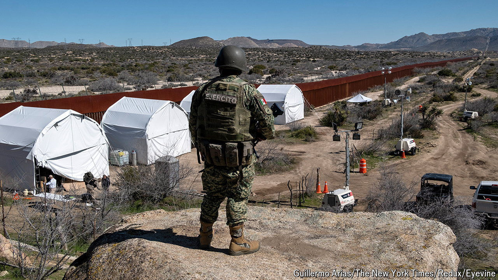

###### A migration merry-go-round

# Fewer migrants are crossing America’s southern border 

##### Joe Biden has Mexico to thank—for now 

 

> May 23rd 2024 

A few statistics regularly released by government agencies set the hearts of America’s political establishment aflutter. Monthly inflation figures are eagerly awaited by Democrats who want to demonstrate that Bidenomics is helping the middle class, and by Republicans howling that it is a failed socialist experiment. Jobs figures have much the same effect. Lately, another measure has joined that list: monthly “encounters” of migrants at America’s southern border. 

Figures released on May 15th show that, after a peak in December of 302,000 apprehensions, the most ever, encounters at the border tumbled by 42% to roughly 180,000 and have stayed relatively flat since January (see chart). That is still high compared with pre-pandemic figures, but it is a marked improvement, and one that President Joe Biden will be thankful for .

