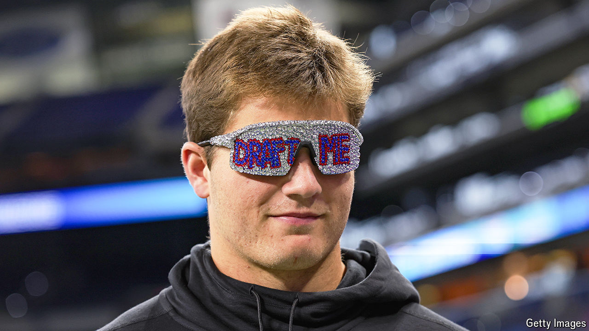

###### Off-season offence

# How the NFL keeps fans transfixed even when there are no games 

##### The show must go on 

 

> May 23rd 2024 

Nothing draws an audience quite like the National Football League. The season opener in September 2023 attracted nearly 25m viewers, and in February almost 124m Americans tuned in for Super Bowl LVIII. Yet the NFL is not satisfied with dominating the media for only five months a year. It has developed an uncanny ability to turn ordinary off-season events into spectacles.

Weeks after the season ends the league hosts a televised “scouting combine” for aspiring players to demonstrate their skills. Then comes the draft, when 32 teams recruit the best college talent. Since it was first televised in 1980, the draft has become a three-day extravaganza featuring live music and celebrity guests. Around 775,000 fans attended in person this year, and some 12m Americans viewed the first round. The NFL’s draft has become bigger than some leagues’ championship games.

