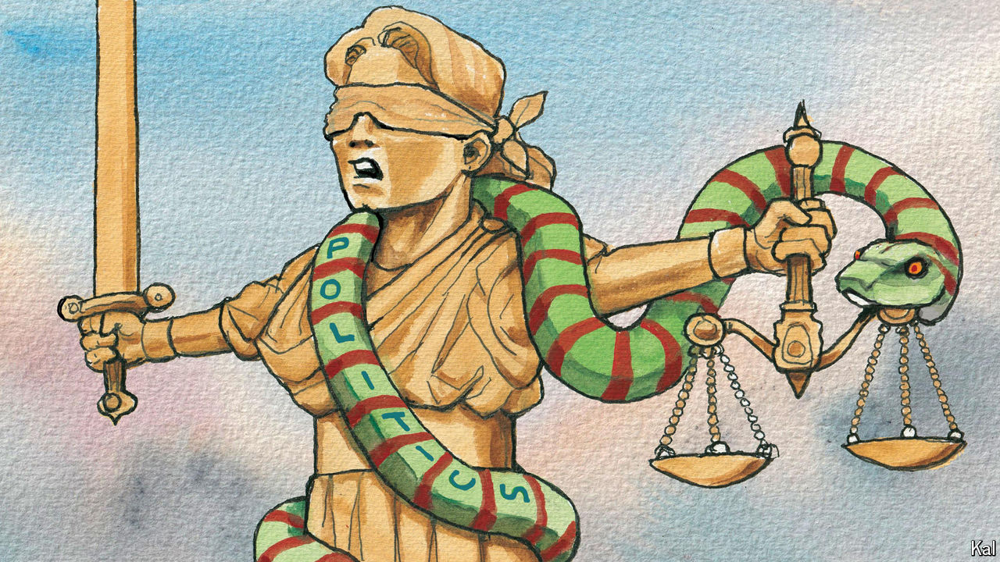

###### Lexington

# Politics is the law in Texas 

##### A governor’s pardon implies that courts cannot be trusted, just as Donald Trump says 

 

> May 23rd 2024 

An American military veteran was killed in the street, presumed to pose a threat when he was exercising his right to carry a gun in public. You might expect America’s gun-rights advocates to demand justice for the dead man.

But here’s a bit of important context: when he was killed, that man, Garrett Foster, was marching in a Black Lives Matter (BLM) protest in Austin, Texas, in July 2020. The person who shot him, Daniel Perry, was sentenced to 25 years in prison for murder. On May 16th Governor Greg Abbott pardoned Mr Perry, saying he acted in line with Texas’s “stand your ground” law, which allows people to use deadly force if they feel threatened.

