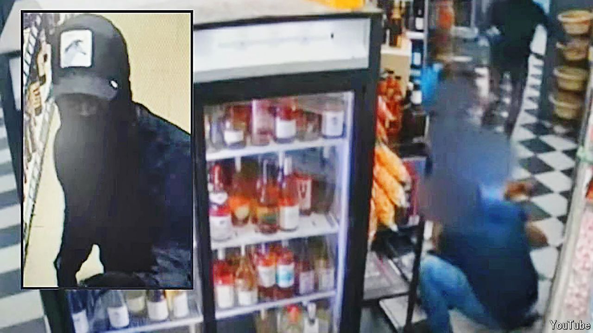

###### U bet

# Some would-be American immigrants are paying to get robbed 

##### Police say this is to get access to visas for victims of crime 

 

> May 23rd 2024 

From the security-camera footage last July, it looks terrifying. Masked men burst into a liquor store in Bucktown, a wealthy neighbourhood in Chicago, pointing guns. Customers stick their hands up, as one gunman waves his weapon furiously. Suddenly, the employee behind the counter disappears, as shards of glass or liquid fill the screen. He has been shot in the stomach. The robbers flee in a stolen Kia car. “They said, give us all of the money,” said Diptesh Patel, the business’s owner, in an interview to local TV news. 

So far, so normal. Liquor-store robberies are hardly rare in America. Yet according to an indictment unsealed in federal court in Chicago on May 17th, this one was staged: some of the victims (though not the man shot) had paid to get robbed. The robbery was one of 16 that prosecutors allege were organised by the defendants, mostly in the Chicago area, but also in Tennessee and Louisiana. According to the indictment, they were conducted “so that the purported victims of the robberies could apply for U-visas”. Six people, four of them Indian nationals, have been charged with conspiracy to commit visa fraud.

