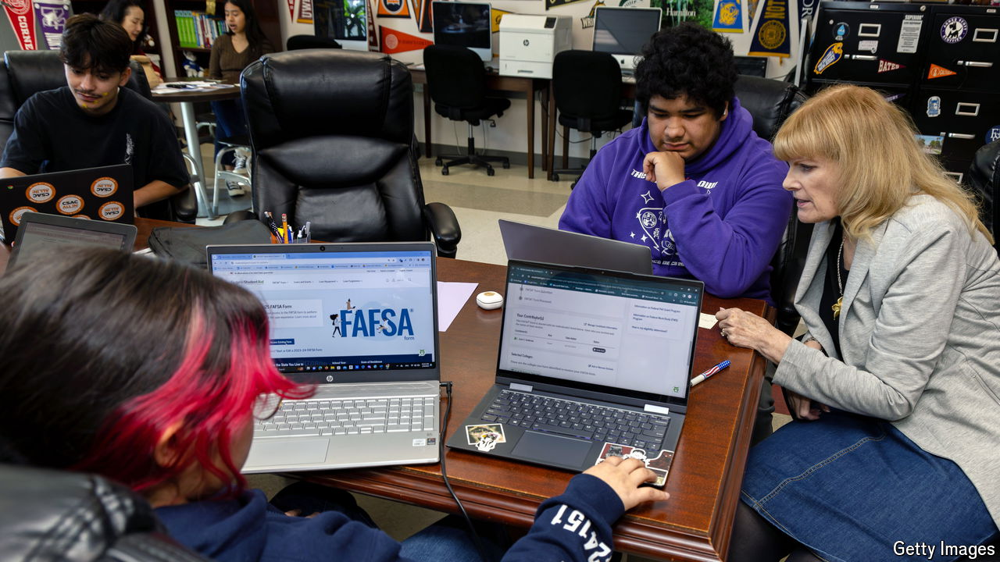

###### The FAFSA foul-up

# Time is running out to fix America’s student-aid mess 

##### The risk of a sharp drop in college enrolment is rising 

 

> May 21st 2024 

BY EARLY MAY, people heading to college in America have usually settled on an institution and sent the first of several large cheques. This year, a government cock-up has left admissions in a mess. For months youngsters have been struggling to apply for student loans, Pell grants and other financial aid—the result of a botched effort to revamp the system through which these are doled out. The question is no longer whether this will drive down the number of people starting degree courses this autumn, but how sharp the drop will be.

At the heart of the problem lie changes to the Free Application for Federal Student Aid, or FAFSA—the web form that must be completed to qualify for most federal, state and institutional assistance. No tears were shed when, in 2020, Congress blessed plans to simplify it. Its 100 or so questions have long put off low-income students in two minds about , and exasperated everyone else. Yet the new version did not limp online until months after this year’s college-application season had started. And it was riddled with bugs.

