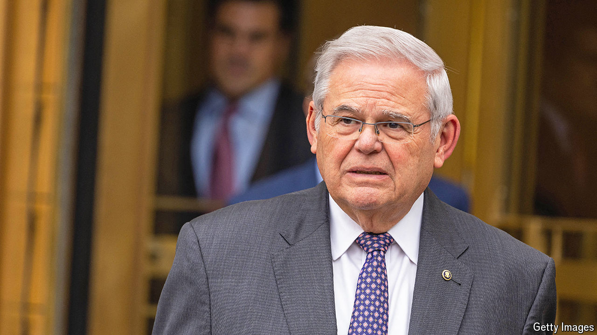

###### Corruption trials

# What the cases of Robert Menendez and Henry Cuellar have in common 

##### The politics-as-usual defence 

 

> May 23rd 2024 

A stone’s throw from the Manhattan courthouse where Donald Trump has been in the dock, an equally picaresque political-corruption trial is under way with less publicity. Robert Menendez, New Jersey’s Democratic senior senator, is charged with bribery and extortion, among other crimes. He allegedly used his influence as chairman of the Senate Foreign Relations Committee to help Egypt and Qatar in exchange for gold bars, a Mercedes and cash. “This was politics for profit,” Lara Pomerantz, a federal prosecutor, declared in her opening statement. Mr Menendez, who asserts his innocence and has declined to resign from office, was a “United States senator on the take”, she added. 

Bribery cases can be hard to get across to a jury if the alleged quid pro quo is subtle or indirect. Mr Menendez’s habits of personal finance have provided prosecutors with some useful visual aids. Last week they showed jurors photos of the alleged loot seized from the senator’s home: not just the now-famous gold bars, but also wads of cash stuffed into a Timberland boot. Federal agents found more cash in bags and in two of the senator’s jackets. The FBI got so flustered counting the money by hand that it had to have two cash-counting machines brought in to tally what turned out to be $486,461. 

