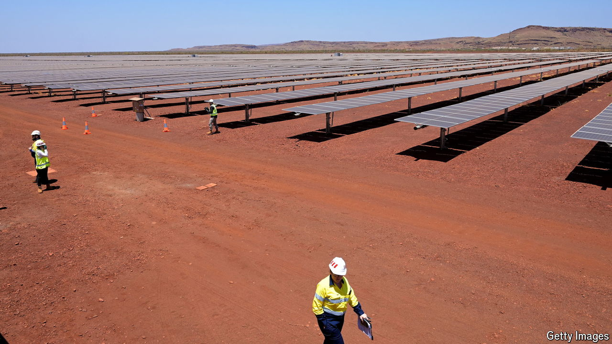

###### Monetising minerals

# Australia joins the industrial arms race 

##### The government hopes to spend its way to a future as a green superpower 

 

> May 30th 2024 

Digging and shipping have turned Australia into one of the world’s richest nations. The country mines its vast reserves of everything from iron ore and coal to lithium and gold, and exports them. Yet as the threat from climate change grows more urgent, it faces job losses in the fossil-fuel sectors that made it rich. To make up for that and to stave off industrial decline, Australia is joining the ranks of governments around the world spending billions to build green industries. 

On May 14th the centre-left Labor government presented a budget that looks like a smaller version of America’s $1trn Inflation Reduction Act (IRA), which aims to revive American manufacturing. It allocates almost A$23bn ($15bn) in subsidies and tax credits to clean energy and other technologies the government considers strategic. That includes almost A$14bn in tax breaks to help Australia establish a green hydrogen industry and to start processing “critical minerals” such as copper, lithium and rare earths that are needed for the transition to clean energy.

