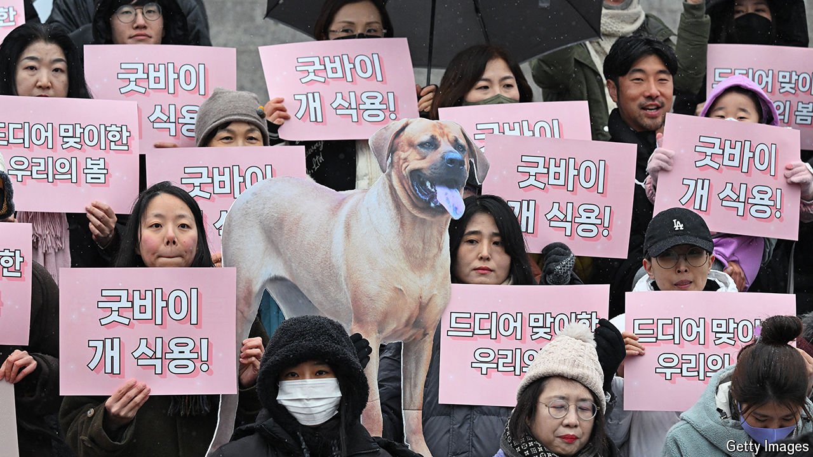

###### Four legs good

# Bans on dog meat sweep across Asia 

##### Three reasons lie behind the cuddly trend 

 

> May 30th 2024 

Gamey and rich, the first thing that grabs you about dog meat is the smell. Next, the taste: a fusion of beef and mutton, as one culinary adventurer has written. Last, the origin, and that is what sticks. Of the perhaps 30m dogs ending up in stews and barbecues across Asia, many begin as strays or pets. Even when farmed, it is a grim business. Unlike pigs and cows, dogs carry rabies; vaccinations are not routine. Campaigners accuse farmers of brutal slaughter techniques. But consumption endures. Some Asians prize dog meat as a delicacy: a savoury delight, a ward against bad luck or a supposed palliative for heat.

Lately, though, Asia has been ditching dog. In January South Korea joined China, Taiwan, Thailand and Singapore in banning the dog-meat trade. Cat meat is sometimes banned, too. Regional bans have spread, from Cambodia’s Siem Reap province to India’s Nagaland state. Enforcement is being tightened. In February officials in Hong Kong arrested five Vietnamese caught hawking frozen dog and cat meat. Even in Vietnam, where the trade is still legal, shops are closing. 

