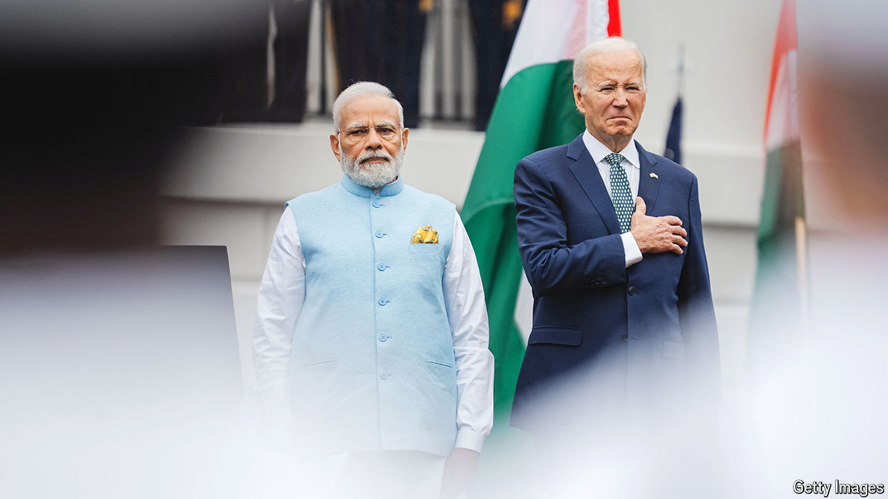

###### Diplomatic inertia

# Is America giving Narendra Modi an easy ride? 

##### The West is struggling to balance interests and values in India 

 

> May 27th 2024 

BARRING A HUGE political upset, Narendra Modi looks likely to begin a third term as India’s prime minister soon after June 4th, when results of the general election will be announced. But the poll has not been pretty: on March 21st , an opposition leader who is Delhi’s chief minister, was arrested on corruption charges that he calls a political sham. Mr Modi, seemingly unnerved by low turnout, has ramped up  against India’s Muslim minority. Although voting itself has been generally unproblematic, most Western officials agree that Mr Modi has tilted the political pitch by suppressing dissent and weakening democratic institutions. How should they deal with Mr Modi, particularly if his Bharatiya Janata Party (BJP) wins a large mandate?


