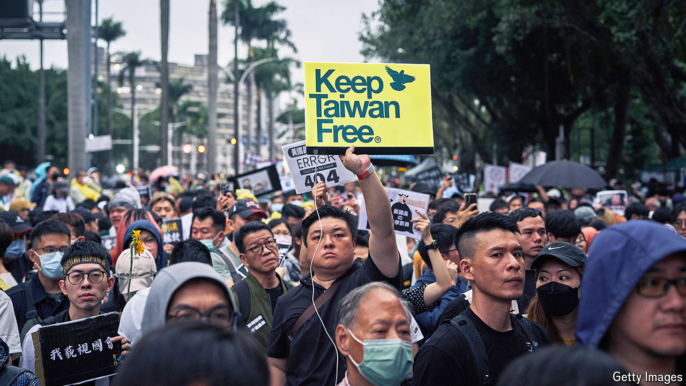

###### A protest against parliament

# Some Taiwanese worry that their lawmakers may sell them out to China 

##### They are protesting against the legislature awarding itself greater powers 

 

> May 30th 2024 

THOUSANDS of people converged on the Legislative Yuan, Taiwan’s parliament, on May 28th. Their placards read “Taiwan for the Taiwanese” and “Tyranny of the majority is not democracy”. They tied white ribbons to police barricades that had been put up around the building. One claimed that democracy was “dead”. 

The target of the protests, which had been bubbling for days, was not Taiwan’s government, but its legislature. In January Lai Ching-te of the Democratic Progressive Party (DPP) was elected Taiwan’s president. Yet in parliamentary elections that were held simultaneously, his DPP lost control of the Legislative Yuan to China-friendly parties. These parties have since been backing amendments that give the legislature much greater governmental oversight, including sweeping investigative powers. As the protesters marched on parliament, the legislature passed the amendments into law.

