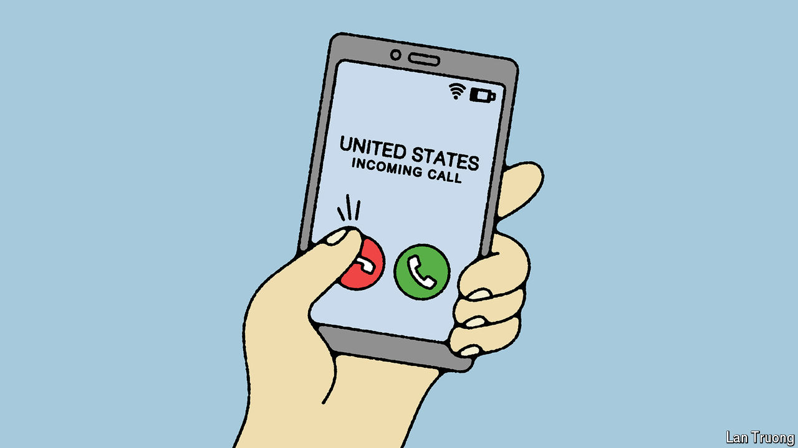

###### Banyan

# Want to stop a third world war? Pick up the phone 

##### America’s and China’s defence ministers will meet in Singapore. They need to talk more 

 

> May 30th 2024 

ON COMING to power Jim Hacker, the protagonist of “Yes, Prime Minister”, a British comedy series, asks about the hotline to the Kremlin. It works only “theoretically”, he is told; once they reached a switchboard operator who “didn’t seem to speak much English”. What’s more, using it “tends to create unnecessary panic at the other end”.

The farce springs to mind for those who, these days, urgently try to speak to China about security frictions in Asia, from its  of neighbours over disputed islands and shoals to its wargames around Taiwan. The Philippines has a hotline to China’s foreign ministry. But when it calls to discuss China’s water-blasting of its coastguard ships, the Chinese either do not answer, or say the hotline is not for “complaints”, or accuse the Filipinos of causing trouble. Japan’s defence-ministry hotline has not stopped intensified Chinese probing of contested waters.

