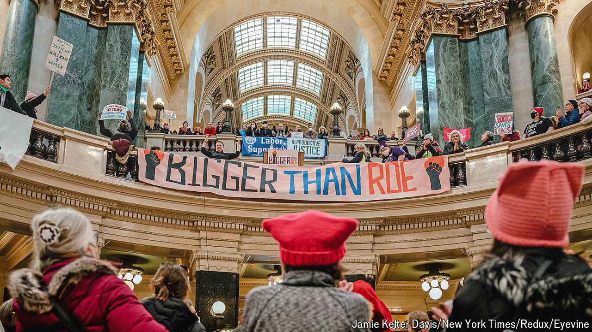

###### Abortion and politics

# The undoing of Roe v Wade has created a mighty political movement 

##### The power of women with clipboards 

 

> May 30th 2024 

Hikers climbing out of their cars early in the morning at North Mountain Park in Phoenix, Arizona, are welcomed by songbirds and two women behind a fold-up table. “Would you like to protect a woman’s right to choose?” asks Beth Ballmann, from beneath a bright pink sun hat. A barely awake young man mumbles something about not being registered. Linda Chiles’s eyes light up. “I can help you with that too. We can do it today!”

Along with many others, the two women are trying to collect enough signatures to add a referendum to Arizona ballots in November, which would enshrine the right to abortion in the state constitution. The volunteers wear “We Can Do It” Rosie the Riveter T-shirts bought on Amazon. They have carried their clipboards to car parks, yoga classes, the state fair and many doorsteps. “They can’t escape us this time,” Ms Chiles whispers, as a couple returns from a hike. Indeed they don’t. 

