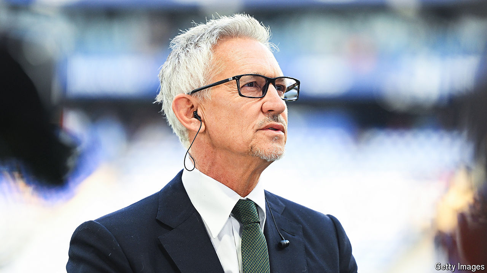

###### In the box, and on it

# Footballer, broadcaster, podcast mogul: the career of Gary Lineker 

##### And what it says about modern Britain 

 

> May 25th 2024 

The afterlives of English footballers typically involve a stint in coaching or a spot of punditry. The glaring exceptions are David Beckham, a businessman and walking brand, and Gary Lineker. “He’s probably got the edge on looks,” Mr Lineker concedes, in the self-deprecatory tone that helped make him an A-list broadcaster and, in his latest incarnation, a podcast star. His career—a startling run of successes, punctuated by controversy—encapsulates deep trends and faultlines in England’s personality. 

Listening to Mr Lineker, now 63, you might conclude that he was never much of a footballer. On his podcast, “The Rest is Football”, another retired striker, Alan Shearer, ribbed him recently for scoring goals from a few yards out. “I couldn’t kick it any further,” Mr Lineker deadpanned. The show, he says, aims to mix insight with fun. A team of him, flinty Mr Shearer and exuberant Micah Richards, also an ex-player, has helped make it one of the most downloaded sports podcasts in Britain.

