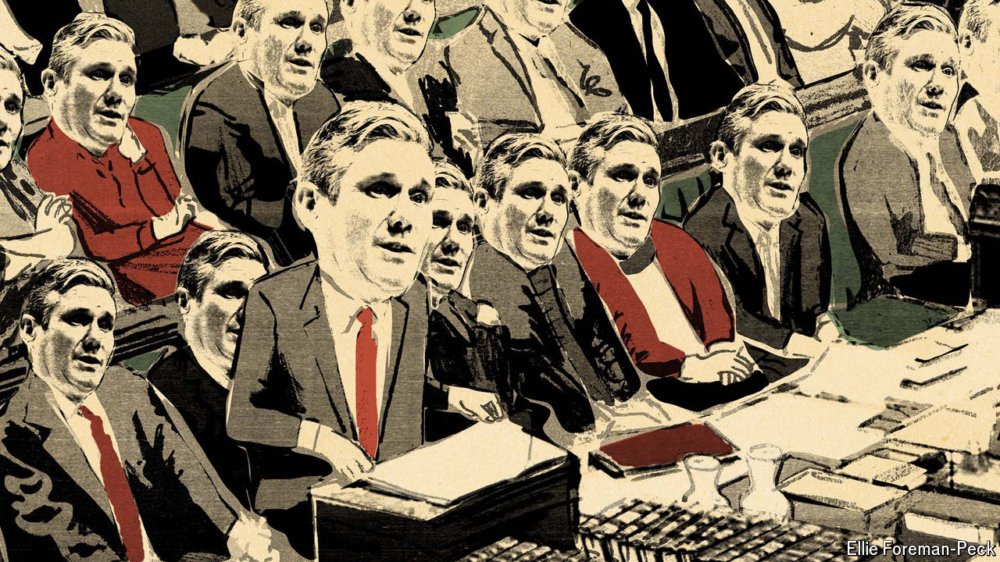
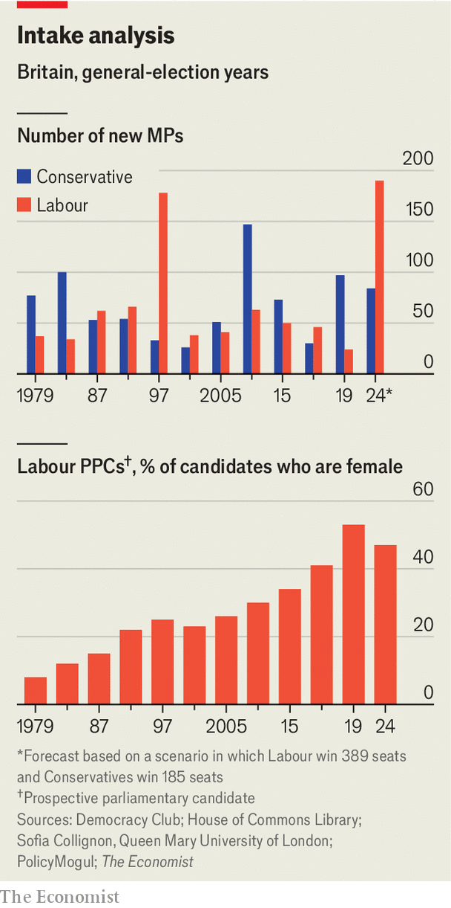

###### Prospective MPs

# Generation K: Keir Starmer’s cohort of Labour candidates 

##### Who are the people who might reshape British politics for years to come? 

 

> May 30th 2024 

IMAGINE the seats up for grabs in the general election on July 4th are sorted in order, from ones that Labour are most likely to gain from other parties to those they are least likely to. As of May 29th ’s  shows that High Peak in Derbyshire would be most likely to fall to Labour if an election were held tomorrow; Jon Pearce, an employment lawyer who once worked shifts in McDonald’s, has a 99.96% chance of becoming its MP. If the party wins 389 seats—the central scenario in our prediction, giving Sir Keir Starmer a majority of 128—the last seat to turn red would be Amber Valley, also in Derbyshire, where Linsey Farnsworth, a former public prosecutor, is the candidate. 

 


