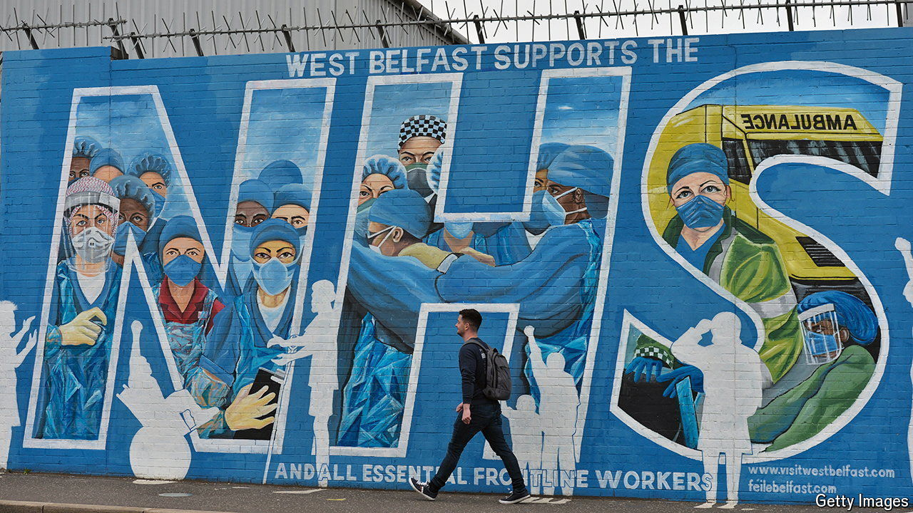

###### Outlier or omen?

# Half of Northern Irish patients wait over a year for treatment 

##### The crisis in health care is a warning to the rest of Britain 

 

> May 30th 2024 

IF YOU ARE ever in Northern Ireland, pray that you never need a gallbladder removal, a neurology appointment or a hip replacement. For these treatments, patients routinely face waits of several years to be seen. Hospital waiting lists, on which the equivalent of a quarter of the population languish, are just the tip of the province’s health-care crisis. According to the Royal College of Emergency Medicine, three times as many people died due to delays in emergency departments in 2022 as did during the worst year of . General practice (GP) and social care are also on the brink. People still love the National Health Service (NHS, or Health and Social Care as it is officially known in Northern Ireland). Increasingly, however, they admire a service that no longer exists.

On the other side of the Irish Sea the leaders of the main political parties may be tempted to dismiss these horrors as an outlier. Health care, after all, is a matter for devolved administrations. Before the return of the Northern Irish executive in February, the country had gone two years without a government. Northern Irish politics is still coloured primarily by constitutional questions, which means health care may have comparatively less salience. “There’s a feeling of ‘oh well, we used to kill each other’,” says Deirdre Heenan of Ulster University. Waiting times, though awful in many parts of Britain, are nowhere near as bad as in Northern Ireland: half of patients there wait more than a year for treatment compared with only 4% in England. 

