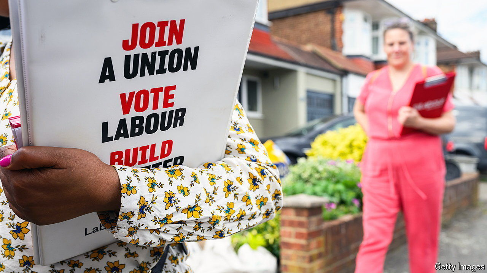

###### Not a postcode lottery

# Labour is worried about safe seats with big South Asian populations 

##### Our analysis shows that activists are not just being dispatched to Tory targets 

 

> May 30th 2024 

Party activists are the infantry troops in any general election. They are the ones delivering leaflets, canvassing voters and getting out the vote. But their number is limited and parties must use them wisely. That means sending activists to marginal constituencies where the election will be won or lost. 

 


