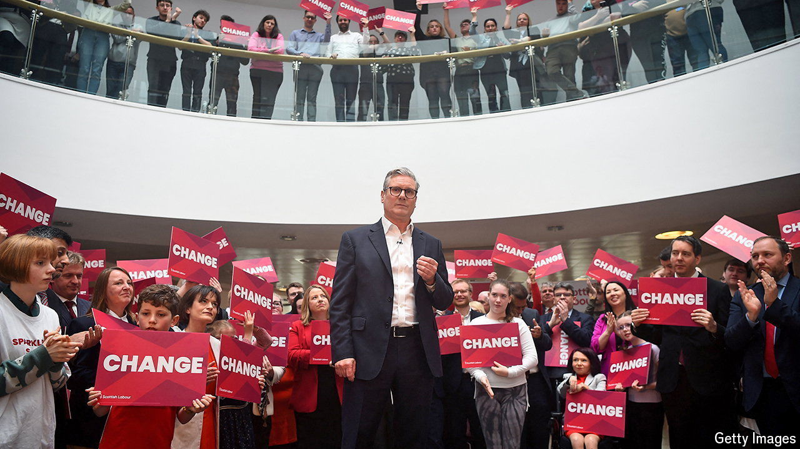

###### Lights, camera…inaction!

# Sir Keir Starmer meets the public. Sort of 

##### The Labour leader is better than he was at campaigning but that is not saying a lot 

 

> May 26th 2024 

It IS two days after the general election was called and Sir Keir Starmer, the leader of the , is on the campaign trail. Sir Keir likes to meet people, in a natural way, “where they are”. In Ipswich he once went “to the bingo” to find people “where they are”; in Blackpool he went “on the beach, on the pier” to find them; today he is visiting a builders’ merchant in Lancashire. Psephologists believe that there are also people in Waitrose in Islington but Sir Keir seems less bothered about meeting those people. 

In Lancashire a freshly washed forklift truck waits on the tarmac to allow Sir Keir to meet its driver, naturally, as he walks past. Less naturally, its driver is not doing any actual work or else, a fellow-employee explains, “Starmer would have to chase after him” to talk. And Sir Keir is here not just to meet people “where they are” but ideally have them stay there for long enough to have his photo taken with them.

