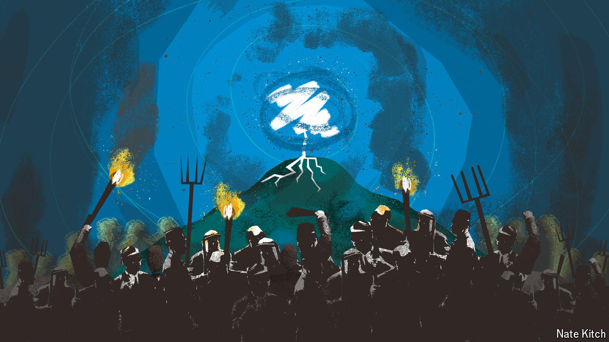

###### Bagehot

# The British election is becoming an episode of mob justice 

##### A punishment beating is on the cards for the Conservatives 

 

> May 29th 2024 

The Conservative Party is deeply unpopular. That is a simple point, but one still often missed. Rishi Sunak, the prime minister, enjoys an approval rating that matches Sir John Major’s at his mid-1990s nadir, when the party was on the cusp of a historic defeat at the hands of Sir Tony Blair. The Conservatives enjoy an average  of 23—about 20 points behind the Labour Party. It is a decent score for a third party; it is a cataclysmically awful one for a party of government. Polls may narrow, say pathologically nervous Labour advisers and desperate Conservative ones. Equally, they may widen. 

Every so often politics is more about punishment than policy. Sir Tony recognised as much when recalling his 1997 election victory. “Once the mood had turned from the government and embraced us, the mood was merciless in its pursuit, indifferent to anything other than satisfying itself.” Sometimes voters are judicious electors seeking a government. Sometimes they are nothing more than a mob seeking revenge. 

