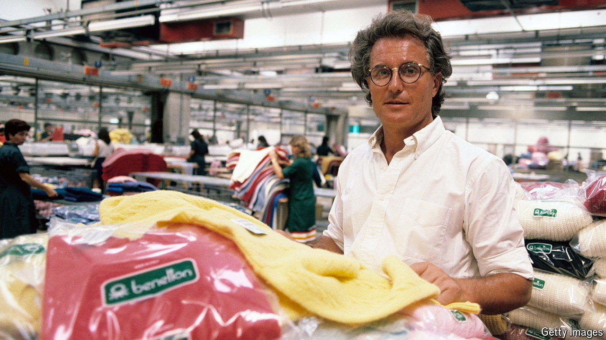

###### Prêt-à-partir

# Can Benetton be patched up? 

##### Italy’s threadbare casual-fashion icon is stained with red ink 

 

> May 30th 2024 

IT WAS A bitter farewell. On May 25th Luciano Benetton, the 89-year-old eponymous co-founder, with his three siblings, of the maker of colourful jumpers, told , an Italian daily, that he would step down as chairman. Signor Luciano, as he is known, explained that he felt “betrayed” by Massimo Renon, the firm’s chief executive. Mr Renon was, in Mr Benetton’s telling, insufficiently transparent about a pre-tax “hole” of some €100m ($108m). That lack of transparency, and Benetton’s threadbare results, provoked the near-nonagenarian to throw in the towel. For the first time since its creation in 1965, Benetton will have to make do without a Benetton. 

The company says that Mr Renon did not break any rules or laws. On May 28th its board approved the financial statement for 2023. Revenue was €1.1 bn, with a net loss of €230m. Still, on the same day it said that Mr Renon would be replaced by Claudio Sforza, a restructuring expert with no experience in fashion but plenty in the turnaround of struggling firms. 

