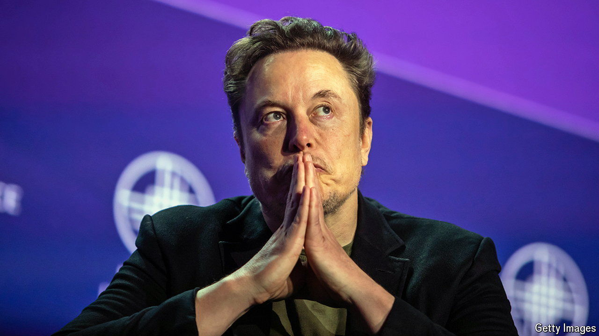
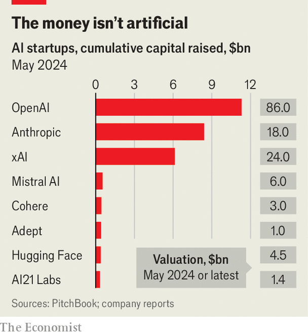

###### Upping the X ante

# Can Elon Musk’s xAI take on OpenAI? 

##### It has some advantages. But it is entering a crowded field 

 

> May 29th 2024 

Every day seems to bring fresh bets on artificial intelligence (AI). In the past few weeks CoreWeave, an AI cloud-computing company, and H, a French AI startup, have raised hefty sums of money. On May 26th it was Elon Musk’s turn. The tech billionaire’s startup, christened xAI, said it had raised $6bn at a valuation of $24bn. The investors include such Silicon Valley stalwarts as Sequoia Capital and Andreessen Horowitz, two venture-capital (VC) giants, and an investment fund with ties to the Saudi royal family. Their lavish backing puts xAI’s financial firepower in the big leagues, alongside model-builders such as , the creator of ChatGPT, and Anthropic (see chart). Can Mr Musk compete with the AI superstars?

 


