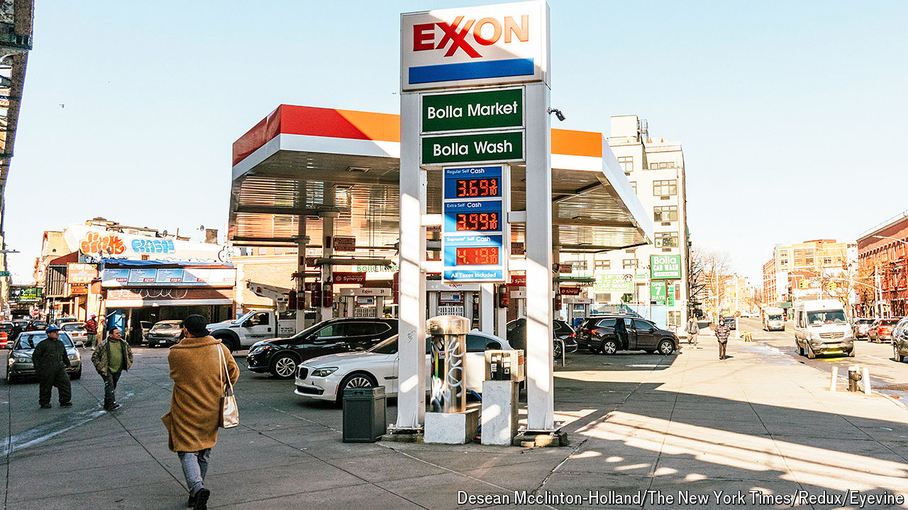

###### Back, with a vengeance

# ExxonMobil rediscovers its swagger 

##### The bad boy of big oil goes after its shareholders 

 

> May 29th 2024 

FOR YEARS ExxonMobil was the top dog among the world’s private-sector oil companies. It was the biggest of the Western majors, and the best-managed. It regularly posted higher returns on capital than its peers and enjoyed superior stockmarket valuations. This led to an arrogance among its chief executives that infuriated not just greens but even other oilmen. In 2003 Lee Raymond, a former boss with a ferocious temper, bragged that “everyone at this company works for the general good—and I’m the general of that general good.” 

More recently ExxonMobil appeared to have lost some of this braggadocio. Between 2016 and 2020, together with the rest of the industry, it eked out meagre returns as oil prices languished. At the same time it was hounded by climate activists and asset managers concerned about environmental, social and governance (ESG) issues. The lowest point came three years ago when it suffered an unprecedented defeat at the hands of Engine No.1, an obscure activist fund that managed to get three climate-minded directors elected to its board. 

