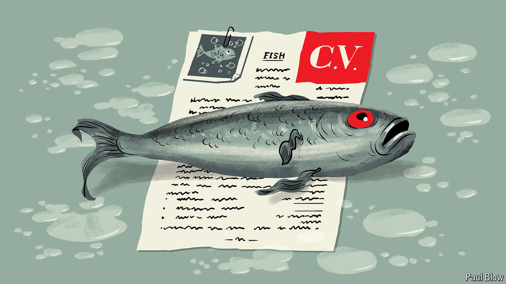

###### Bartleby


# How to write the perfect CV 


##### A job applicant walks into a bar 

 


> May 30th 2024 


IMAGINE MEETING a stranger at a party. What makes for a successful encounter? Lesson one is to heed the wisdom of a shampoo commercial from the 1980s: you never get a second chance to make a first impression. Lesson two is to remember that you do not need to wear a beret or a fur stole in order to stand out. Lesson three is not to forget that what you leave out matters as much as what you say.


These same principles, it turns out, apply to writing a CV. A resumé is not a list of every job you ever had. It is not your autobiography. It is, like that hair-care advert, a marketing tool. Your audience is made up of recruiters and hiring managers. Like cocktail-party guests, they do not take a long time to decide if they want to keep talking. According to one study, such professionals spend an average of 7.4 seconds skimming a job application. Your guest Bartleby has a few tips on how best to ensure that these seconds count.

