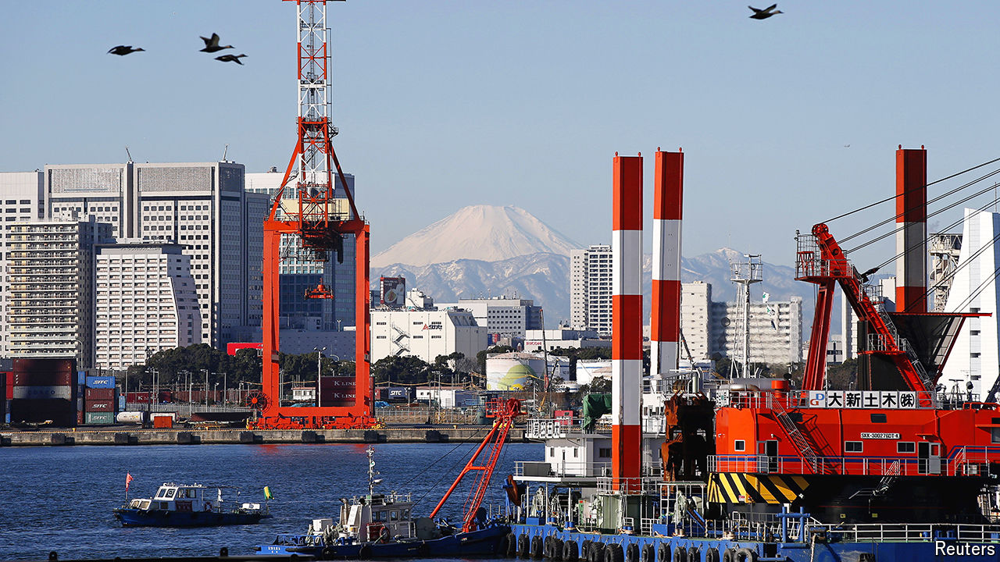
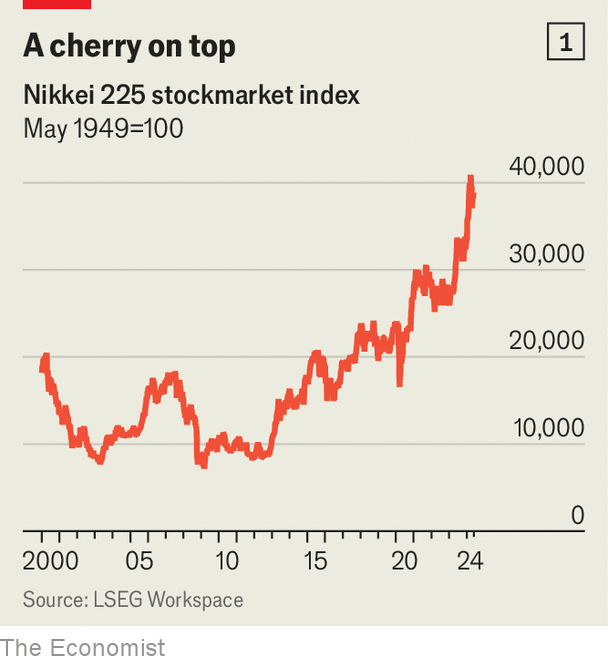

###### Flyover country

# Japanese businesses are trapped between America and China 

##### Could geopolitics kill off an incipient corporate revival? 

 

> May 28th 2024 

Not since the 1980s have Japanese businesses generated so much excitement. Japanese companies’ profit margins have doubled in the past decade or so. They are forking out twice as much to their owners in the form of dividends and share buy-backs as they did ten years ago. Shareholder-friendly changes to corporate governance in Japan have caused foreign investors to flock to the country once again. Having languished for decades, the Nikkei 225 index, which tracks the value of the country’s largest listed firms, is up by 25% over the past year (see chart 1). In February it at last exceeded the record it set in 1989, just before Japan’s bubble burst. 

 


