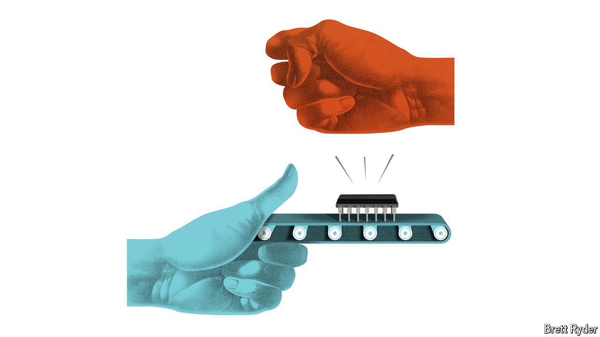

###### Schumpeter

# The soldiers of the silicon supply chain are worried 

##### Geopolitics risks distorting a miracle of modern technology 

 

> May 30th 2024 

There is a wry sense of seen-it-all-before in the crucible of the world’s semiconductor industry. When your columnist took the bullet train to Hsinchu Science Park, home to Taiwan Semiconductor Manufacturing Company (TSMC), the world’s biggest chip producer, on May 24th, China was simulating a military encirclement of Taiwan in waters not far over the horizon. An invasion would be cataclysmic. A blockade could starve the island of vital energy resources. Even cyber-attacks could be crippling. Yet after decades of belligerence, many Taiwanese greet such threats with a shrug. “It’s nothing new to me,” chuckles one seasoned chip executive. “Since 1996 China has been throwing missiles.” 

Semiconductor executives to whom Schumpeter spoke on a tour of Taiwan, South Korea and Japan are not nearly as relaxed about America’s economic manoeuvres against China, though. They say sanctions, subsidies, tariffs and other blunt instruments of geopolitical rivalry and industrial policy may have strategic logic. But they jeopardise one of the miracles of modern technology: the fragile semiconductor supply chain that stretches from East Asia to America and Europe, with Taiwan at its crux. Along it silicon wafers are made and polished, etched with billions of nanometre-size transistors, sliced into microchips and packaged into the brain cells of the digital age. It is a process masterfully honed to combine government support with the invisible hand of the free market. The chip war threatens to bludgeon it. 

