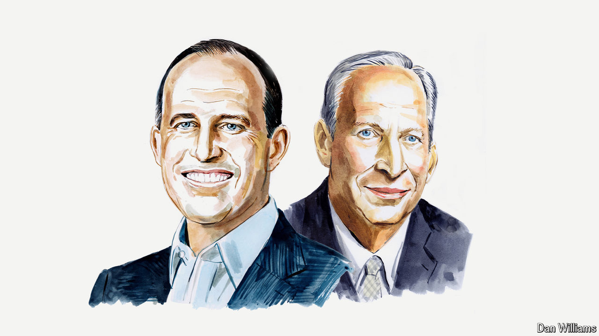

###### Artificial intelligence

# OpenAI board members respond to a warning by former members 

##### The firm is a leader in safety as well as capability, insist Bret Taylor and Larry Summers 

 

> May 30th 2024 

HELEN TONER and Tasha McCauley, who left the board of OpenAI after its decision to reverse course on replacing Sam Altman, the CEO, last November, have offered comments on the regulation of artificial intelligence (AI) and events at OpenAI in a  in .

We do not accept the claims made by Ms Toner and Ms McCauley regarding events at OpenAI. Upon being asked by the former board (including Ms Toner and Ms McCauley) to serve on the new board, the first step we took was to commission an external review of events leading up to Mr Altman’s forced resignation. We chaired a special committee set up by the board, and WilmerHale, a prestigious law firm, led the review. It conducted dozens of interviews with members of OpenAI’s previous board (including Ms Toner and Ms McCauley), OpenAI executives, advisers to the previous board and other pertinent witnesses; reviewed more than 30,000 documents; and evaluated various corporate actions. Both Ms Toner and Ms McCauley provided ample input to the review, and this was carefully considered as we came to our judgments.

