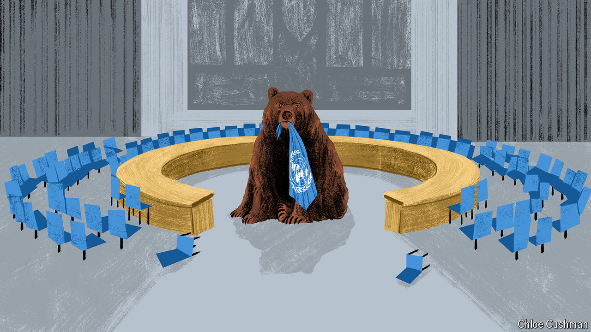

###### Chaguan

# China uses Russia as a wrecking ball 

##### As Russia threatens to paralyse the UN Security Council, China stands back 

 

> May 28th 2024 

IN THESE GRIM and violent times, it may seem odd to fret about diplomatic dysfunction in the United Nations Security Council. But at its best, that forum is a bulwark against anarchy. Its five permanent members—America, Britain, China, France and Russia—are balanced by a further ten governments elected to two-year terms. Responding to crises both large and obscure, council resolutions have over the years imposed sanctions, peacekeeping missions, arms embargoes or, at a minimum, international scrutiny on tyrants, terrorists and coup leaders who might otherwise enjoy complete impunity.

That system is breaking down. Liberal democracies, notably, accuse Russia of playing wrecker at the UN. The country was always truculent and self-serving in the Security Council. Now diplomats worry that Russia is an “existential” threat to it. Irresponsible acts are stacking up. In July last year Russia killed off a UN mission that delivered humanitarian aid to rebel-held areas of Syria, calling it an affront to the sovereignty of the Syrian government, its ally. A month later Russia’s veto ended a sanctions regime in the west African country of Mali. In their final report, UN monitors there reported on killings and crimes involving Malian troops and Russian mercenaries from the Wagner Group. In March this year Russia closed down a UN panel of experts that monitored compliance with sanctions on North Korea’s nuclear and ballistic-missile programmes (and had reported on sanctions-busting arms deals between North Korea and Russia).

