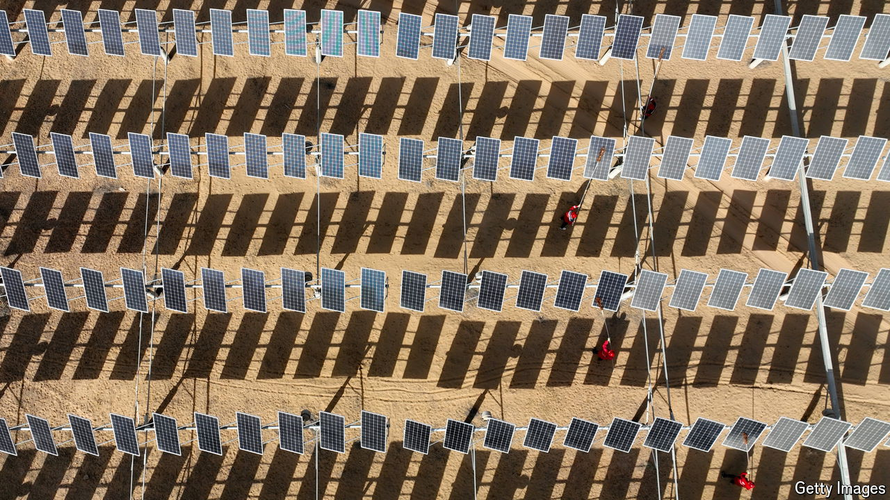

###### Signs of decline

# Has China reached peak emissions? 

##### It hopes to de-link its carbon emissions from economic growth 

 

> May 30th 2024 

IN LATE 2022 the Chinese government dropped its strict controls over the spread of covid-19. That was good for the economy. Factories started humming again and more cars returned to the roads. For the same reasons, it was bad for the climate. In 2023 China’s carbon-dioxide emissions surged by 4.7%, to a record 12.6bn tonnes. China accounted for over a third of the world’s emissions last year.

Now, though, China’s emissions are falling. In March they declined by 3% year on year, the first drop in 14 months, according to an analysis published by Carbon Brief, a specialist news website. Preliminary data show that China’s emissions probably fell in April, too. It is early days, but if this trend continues, the country’s emissions may never again rise to the levels they did in 2023. In other words, they would have peaked.

