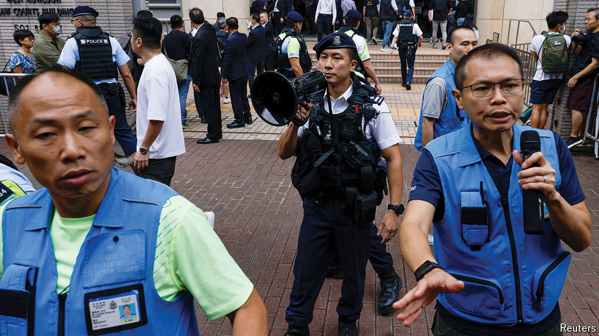

###### Controlling behaviour

# Hong Kong convicts 14 pro-democracy activists 

##### The ruling acts as a warning: dissent and pay the price 

 

> May 30th 2024 

The three presiding judges wasted little time in presenting their verdicts in the case of the “Hong Kong 47”, members of the city’s pro-democracy political opposition. Over the course of two minutes on May 30th, the justices declared 14 of the defendants guilty of conspiracy to commit subversion in the biggest national-security trial in the city’s history. Thirty-one had already pleaded guilty. Two were acquitted.

The activists’ crime was to have held a primary election in 2020 to improve their chances of winning control of the local legislature. With that control, they planned to demand greater democracy—or else to oppose the government’s budget, which would have forced the city’s Beijing-backed chief executive to step down. The authorities alleged that the scheme amounted to an illegal subversion of state power under a national-security law imposed by the central government. The defendants’ attorneys called it normal electoral politics. 

