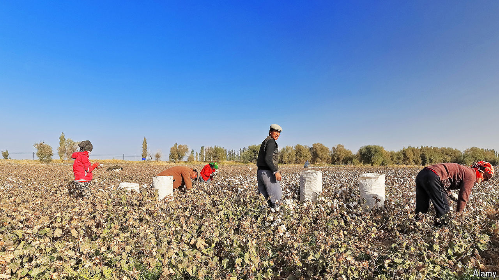

###### Beware the work team

# The evolution of forced labour in Xinjiang 

##### China has wound down its re-education camps, but is still using work to remould the thinking of Uyghurs 

 

> May 30th 2024 

In a village near the ancient Silk Road town of Yarkand, on the edge of the Taklamakan desert in the far-western region of Xinjiang, the  has been busy. The term means “work team”. In Xinjiang it refers to a group of officials dispatched to a poor rural area to change the way Muslim residents live and think. In this village, called Konabazar, the team has been engaged in “ideological mobilisation”. The aim is to persuade reluctant farmers to head off and do other forms of work. 

It is all but impossible for journalists to find out what those ethnic-Uyghur farmers made of the work team’s efforts, which involved lecturing villagers at flag-raising ceremonies and holding night-school classes. Since early 2017, when China began sending a million or more people, most of them Uyghurs, to “vocational education and training centres” (detention camps, in effect), it has become increasingly difficult to get first-hand accounts from victims of China’s repression in Xinjiang. The state justifies its actions in the name of stamping out terrorism, separatism and religious extremism. Western scholars believe the camps were wound down around 2020. But they say official accounts, such as the report about Konabazar, suggest widespread forced labour is still being used for a similar purpose.

