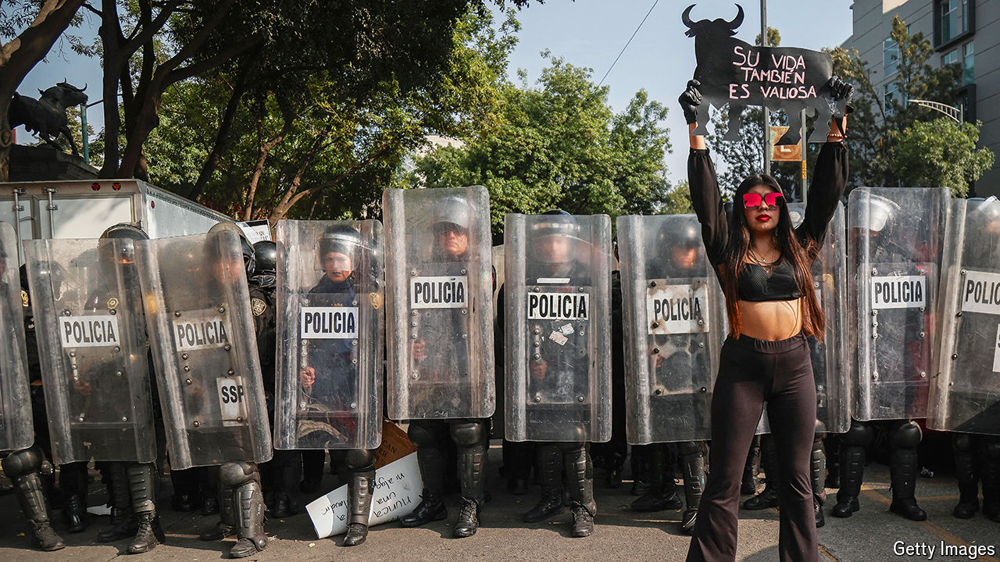

###### Bad sport?

# Bullfighting is under attack 

##### It reveals a lot about politics and attitudes towards Spain 

 

> May 29th 2024 

BOCINERO, half a tonne and dull black, impressed the crowd more than the two bulls who had come and died before him. He hooked his left horn under the right leg of Tomás Rufo, the matador, who landed nearby. The bull pressed his advantage, rolling Mr Rufo several times before other jumped in to distract him. Mr Rufo was soon up limping, shaking off his pain, and before long Bocinero fell under his sword. He died within a minute. (To your correspondent it felt like a very long minute.)

, defying many predictions, still lives. Bocinero was killed in a sold-out stadium at Madrid’s annual San Isidro festival, which honours the city’s patron saint. Every year on May 16th Spanish bullrings observe a moment of silence for Joselito, one of the greatest matadors of all time, killed in the ring in 1920. Danger hangs over the spectacle at all times. A statue of , who discovered penicillin in 1928, stands outside Madrid’s bullring, as thanks from all the fighters who survived severe injuries due to modern medicine. 

