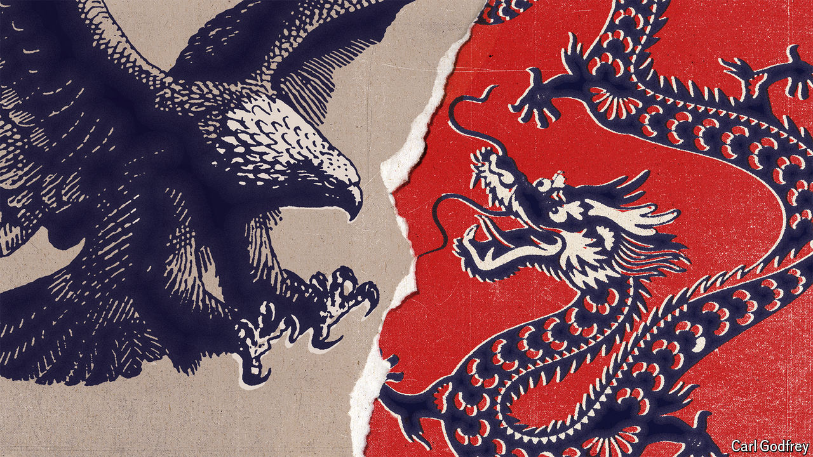

###### Braking China

# Is time more on America’s or China’s side? 

##### A new book offers practical advice about how America can win against China 

 

> May 30th 2024 

. By Dmitri Alperovitch and Garrett Graff. 

Though the wording may vary between “containing”, “deterring”,  or , the Washington consensus is that China represents the pre-eminent threat to America. Changes of administration scarcely matter on this point. In 2019 Joe Biden slammed Donald Trump, then the president, for threatening to impose tariffs on Chinese imports, only to impose  himself in May. The China challenge has prompted a barrage of punditry; since March at least two books have been published whose titles declare a “new cold war” with China.

