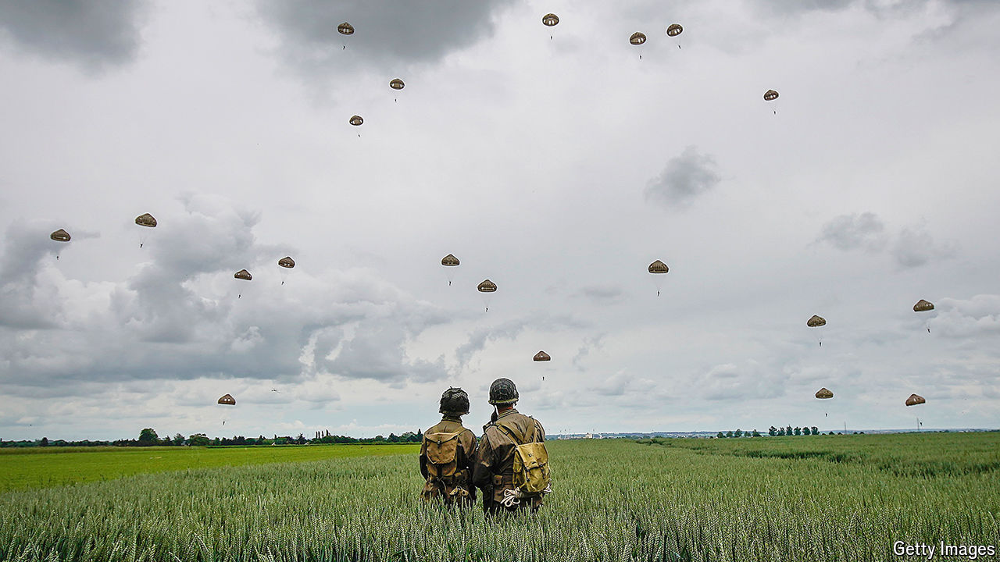

###### Beaches like no other

# Remembering D-Day, as a new war rages in Europe 

##### World leaders and surviving soldiers will attend the 80th anniversary of Normandy 

 

> May 30th 2024 

Bob Fagan was a 21-year-old private from Texas when he plunged from his assault craft into the cold sea off Utah Beach in Normandy, under the rattle of Nazi machinegun fire and air bombardment. “The water was red with blood,” he later recalled. “There were bodies floating all around us.” A fellow member of the 299th combat battalion landing on Omaha Beach had a simpler description: “Hell.” 

Of the more than 150,000 Allied troops who arrived in Normandy on , 9,000 were killed or wounded within the first 24 hours. D-Day (which stands simply for day) or   (as it came to be known in France) was a turning-point in the Allied campaign to push back Nazis on the Western Front, liberate France and defeat Hitler’s Germany in 1945. 

