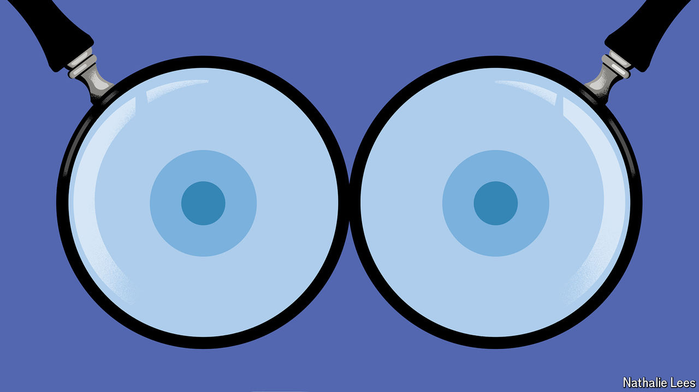

###### The booby trap

# There is more to breasts than meets the eye 

##### A new book offers a cultural history of mammary glands 

 

> May 28th 2024 

By Sarah Thornton. 

DEPENDING ON HOW you look at them, breasts can take very different shapes. Bare busts can be eroticised or neutral, a symbol of women’s liberation or their oppressive objectification. Perky, ample bosoms are held up as a feminine ideal in popular culture, but those in possession of them report discrimination at work and other negative effects. They are glorified as sources of sustenance for infants: the World Health Organisation preaches that “”, and doctors call the milk “liquid gold” for its nutrients and antibodies. In some countries, however, those who nurse in public attract uneasy glances, sometimes even reproof.

