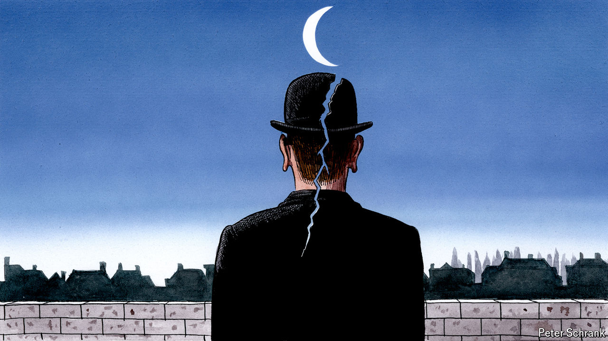

###### Charlemagne

# Ceci n’est pas un divorce: why surging separatism won’t break Belgium 

##### A surreal country with the politics to match 

 

> May 30th 2024 

One Wednesday evening in 2006, Belgian television interrupted its regular programming to announce the unexpected demise of the country. The regional parliament of Flanders, the Dutch-speaking rich northern region, had unilaterally declared independence. Footage was proffered of the king fleeing his palace; a news crew filmed as Flemish crowds cheered the birth of a new nation and commuters grumped when told their trams were stranded at the newly erected border splitting the country for the first time since its birth in 1830. What turned out to be a spoof was convincing enough for thousands of Belgians to call the television station in a panic. Ambassadors posted to Brussels were said to have hastily relayed the news back home (whether any foreign ministries were paying much attention to the fate of Belgium is another matter). Politicians fumed that the joke had been in poor taste—not surprisingly, given it had been at their expense.

Looking at the polls ahead of Belgium’s regional and federal elections on June 9th, some may think reality has caught up with fiction. Flemish nationalist parties are poised to fall just short of a majority in their region, where a bit more than half Belgium’s population of 12m live. The leader of the biggest such outfit, Vlaams Belang (VB), has called Belgium a “forced marriage” and says he will work towards an amicable dissolution from Wallonia, the French-speaking region which along with bilingual Brussels makes up the rest of the country. Failing that, a unilateral declaration of independence will be proposed, for real this time. In the federal parliament around a third of seats will go to parties which would rather there was no federal parliament. 

