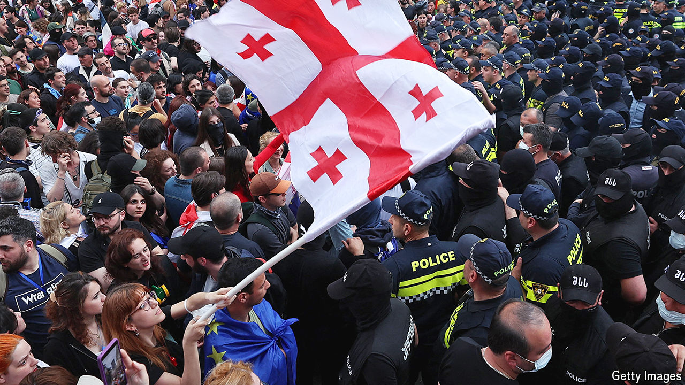

###### Captive in the Caucasus

# Georgia’s government cosies up to Russia 

##### Pro-Western Georgians seem powerless to stop it 

 

> May 30th 2024 

THERE ARE no Russian tanks rumbling towards Tbilisi, the capital of Georgia, or Russian missiles flying over it—both things that happened during a five-day incursion in 2008 when the Kremlin attacked its former imperial vassal. But Georgia is still in mortal peril. The struggle between Soviet past and possible European future has already devastated Ukraine, and plunged Russia itself into a state of dictatorship. Now it has spread to the Caucasus, threatening Georgia’s democracy, its independence and its Euro-Atlantic calling. 

Once considered a beacon of democracy and a staunch Western ally, Georgia is being pushed into Russia’s sphere of influence and away from the West, not by Russian soldiers but by its own ruler, a reclusive businessman named Bidzina Ivanishvili. He made his billions in Russia in the 1990s and has ruled Georgia since 2012, largely from behind the scenes through the party he founded, Georgian Dream. 

