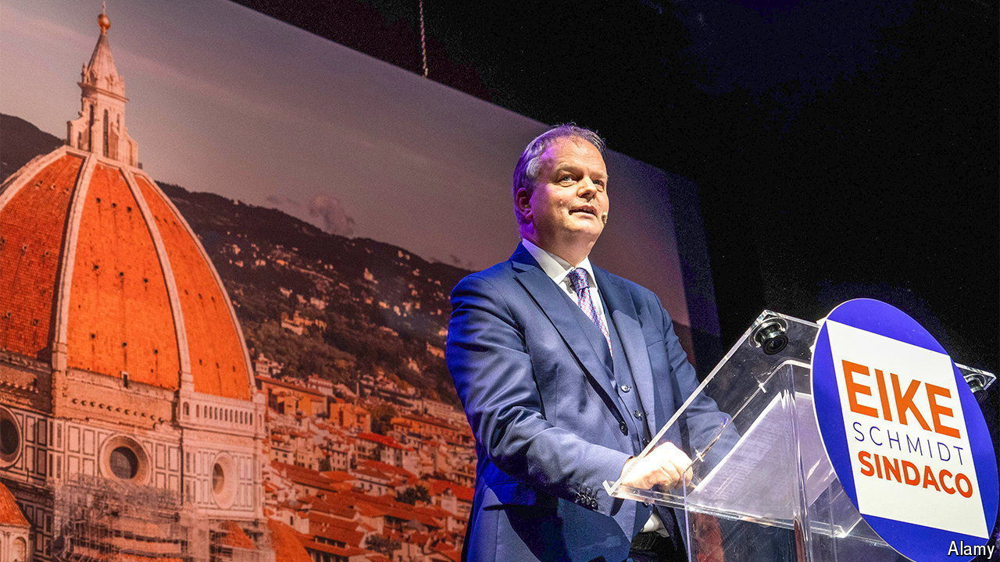

###### From Uffizi to office?

# The Brothers of Italy take the fight to Florence 

##### The city is an opposition stronghold 

 

> May 30th 2024 

It is barely ten o’clock on a Saturday morning, yet Eike Schmidt has drawn nearly a hundred attentive listeners to a pizzeria in Le Cascine, a large park on the edge of Florence. But then the German-born Mr Schmidt is the most unusual mayoral candidate in the local elections in Italy that coincide with its European Parliament election on June 8th and 9th. Pink-faced and tall but paunchy, he is every inch a son of his native Freiburg. His Italian, though grammatically impeccable, is slightly accented and occasionally hesitant.

Mr Schmidt, who became an Italian citizen in 2023, spent eight years as director of Florence’s Uffizi Galleries. Now he hopes to win, with a slate backed by the ruling coalition including Giorgia Meloni’s Brothers of Italy, a city that is among the last strongholds of the centre-left Democratic Party (PD), and one with bitter memories of German occupation in the second world war. Mr Schmidt, 56, though born long after it ended, says, “I am ashamed to be of German origin because of what was done in Europe during the Nazi era.”

