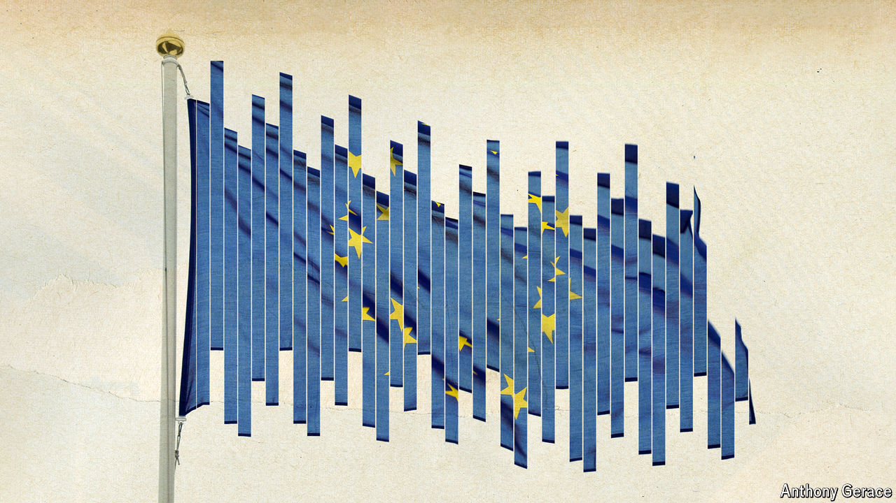

###### Europe votes

# The rise of the hard right threatens Europe’s political stability 

##### European elections could mean gridlock in Brussels and beyond 

 

> May 30th 2024 

Voters in America are often asked by politicians if they are better off now than they were four years ago. As they look forward to European elections on June 6th-9th, their transatlantic counterparts would probably rather not delve much into the five years since they last trudged to the polls. The European Union has had a half-decade to forget. Eight months after the vote in May 2019 the bloc lost a member for the first time in its six-decade history when Britain left. Weeks later covid-19 hit. The continent emerged from lockdown to face war on its doorstep and an energy crisis that has laid its economy flat and boosted the fortunes of xenophobic parties. 

Those assuming things can only get better may be in for a reckoning. Yes, Brexit has been dealt with, energy prices are lower and the pandemic a blurring memory. But the war in Ukraine endures and the hard right of Marine Le Pen in France or Viktor Orban in Hungary is gaining ever more ground. Worse, the probable outcome of the election will be a period of political rudderlessness. At best, its 27 national leaders and the EU’s central institutions will spend months focused on internal machinations, such as who gets what job in Brussels. At worst, rows about the future direction of the EU could last past the end of the year—leaving a political vacuum there, even as a putative Trump administration prepares for office.

