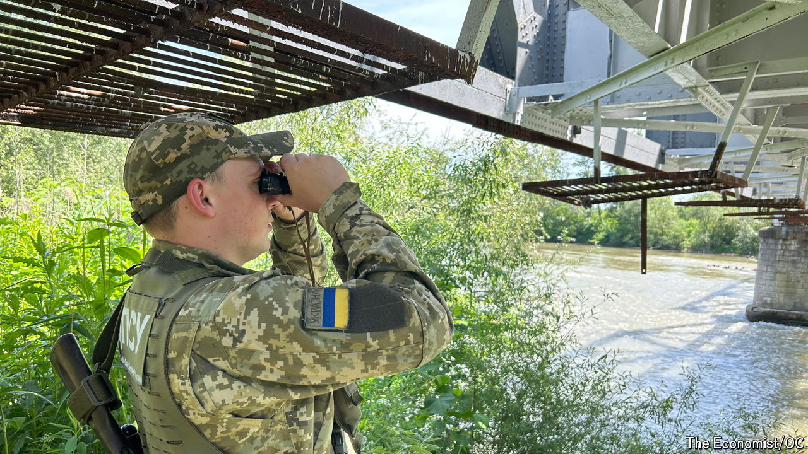

###### No way back

# Ukraine’s desperate draft-dodgers drown in the river of death 

##### Thousands of military-age Ukrainians are risking their lives by swimming across treacherous waters 

 

> May 29th 2024 

MATVIY, A 24-YEAR-OLD Ukrainian engineer, counts himself among the lucky ones. There were moments, he says, when he thought he wouldn’t make it. The frigid waters of the Tysa river, which form part of the border between Ukraine and Romania, proved far more formidable than he and the trio of fellow draft-dodgers had bargained for. The fast currents carried the strongest swimmer 200 metres downstream. Two were thrown twice that distance, reaching the other side only by a minor miracle. “We could barely breathe by the time we emerged,” Matviy says. “We very nearly drowned.”


