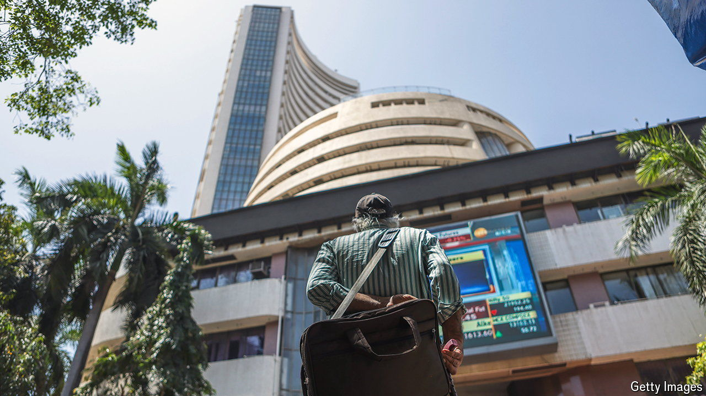

###### Gift horse

# Foreign investors are rejecting Indian stocks 

##### A roaring economy is not enough to entice them 

 

> May 30th 2024 

How to explain the disparity? India’s economy is growing astonishingly fast, Bangalore and Mumbai have become destinations for bosses of global financial firms and Narendra Modi trumpets the country’s appeal in his electoral campaign. Given the enthusiasm, surely foreign money is flooding into the country.

Not quite. In April foreign investors dumped $1bn-worth of Indian shares. In May they dumped another $4.2bn. This is a sliver of the roughly $900bn of Indian shares in foreign hands, but it is a striking move given the mood music—and one that has pushed the share of the Indian stockmarket held by foreigners to just 18%, its lowest in a dozen years.

