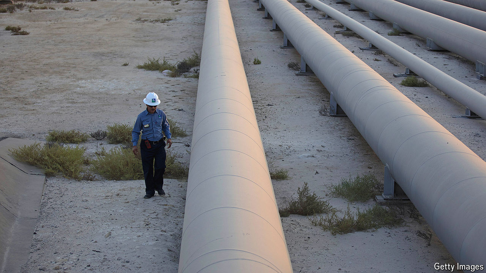

###### In the shadows

# OPEC heavyweights are cheating on their targets 

##### That is tamping down global oil prices 

 

> May 27th 2024 

The Organisation of the Petroleum Exporting Countries (OPEC) and its allies, a group that produces 40% of the world’s crude, wants to keep oil prices high and stable. Lately they have certainly been stable, if not very high. Despite the recent  and the escalating war in Gaza, prices of Brent crude, the global benchmark, have stayed within $2 of $82 a barrel since the start of May. 

Part of the reason why OPEC is failing to boost prices is because its members are failing to stick to their output targets. In March the group’s leaders and Russia extended production cuts, vowing a reduction of 2.2m barrels a day (b/d), or 2% of global supply, until the end of June, on top of 3.7m b/d of previously agreed cuts for 2024. Yet the cartel is now overproducing so much that its daily output in 2024 is little changed from the last quarter of 2023. This will create tensions when members decide their strategy at OPEC’s ministerial meeting on June 2nd. 

