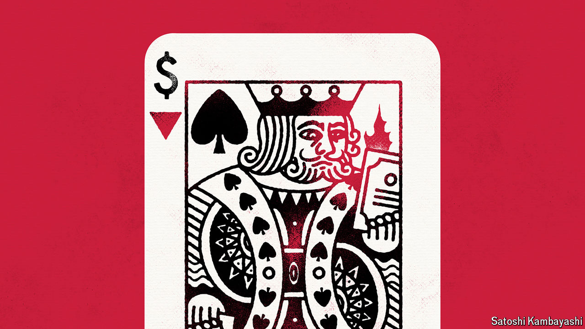

###### Buttonwood

# When to sell your stocks 

##### Poker provides investors with helpful guidance 

 

> May 30th 2024 

Watch professionals play poker, and one of the first things to strike you is how often they fold when the game has barely begun. Rounds of Texas Hold’em, a popular variant, start with each player being dealt two cards and then deciding whether to bet on them. Amateurs are more likely to proceed than not, while pros fold immediately up to 85% of the time. Naturally this does not mean that high-stakes casinos are frequented by the timid. It is simply that most hands are too likely to lose to be worth betting on, and the pros are better at judging when this is the case.

Investors usually dislike gambling comparisons. Yet at a recent conference held by Norges Bank Investment Management, which oversees Norway’s oil fund of $1.6trn, a packed hall sought to learn from a former poker pro. Annie Duke was there to talk about quitting decisions, a topic on which she wrote the book (“Quit: The Power of Knowing When to Walk Away”). Ms Duke argued that many factors stack the deck against people considering quitting, pushing them to act irrationally. That applies to poker players wondering whether or not to fold—and also to investors considering whether to exit a position. 

